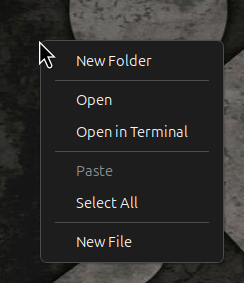
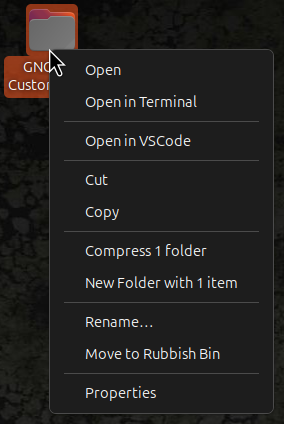
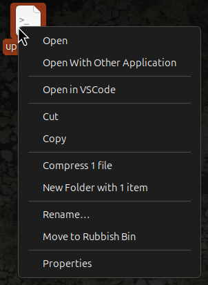
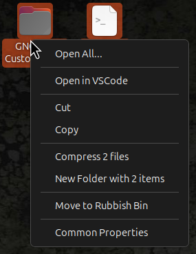
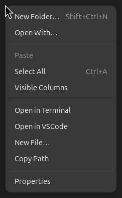
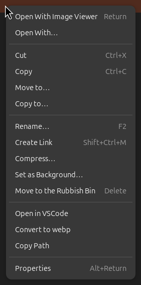

# GNOME Custom Extensions
A collection of customised GNOME extensions for GNOME Shell and GNOME Nautilus.

## Feature Showcase
### Eclipse DVD Screensaver
Adds multi-monitor support and cursor hiding.

https://github.com/user-attachments/assets/e9ee64c5-6f92-4dcd-bd6e-b5313b335829

GNOME panels (e.g. the notification panel) still appear on top of the screensaver since the screensaver is only a black overlay but this is still much less annoying than the cursor being visible.

### Desktop Icons NG (DING)
Moves around existing context menu entries to suit my needs and adds an "Open in VSCode" entry to open files and projects directly in VSCode from the desktop.

<div style="gap: 10px; padding: 5px;" align="center">
  
  
</div>

&nbsp;

<div style="gap: 10px; padding: 5px;" align="center">
    
    
</div>

### Nautilus Python
A custom Nautilus context menu using nautilus-python. It contains :

- "Open in Terminal" : obsolete in Ubuntu 26.04 but still useful for Ubuntu 24.04
- "Open in VSCode" : open folder or file in VSCode
- "Convert to webp" : convert image files to webp format
- "New File" : create "file" then "file_1" then "file_2"...
- "Copy Path" : copy the absolute path of all selected items (or current location if background was clicked) to clipboard

<div style="gap: 10px; padding: 5px;" align="center">
    
    
</div>

Unfortunately, the menu cannot be set above or below the one-before-last section in the context menu but I can live with it.

## Installation
### Eclipse DVD Screensaver
1. Download the extension from [GNOME Extensions](https://extensions.gnome.org/extension/8755/eclipse-dvd-screensaver/)
2. Overwrite `extension.js` in extension root (`~/.local/share/gnome-shell/extensions/eclipse-dvd-screensaver@sudoyasir.github.com`)
3. Restart GNOME Shell (Alt+F2, then type `r` on X11, logout and log back in on Wayland)

### Desktop Icons NG (DING)
1. Download the extension from [GNOME Extensions](https://extensions.gnome.org/extension/2087/desktop-icons-ng-ding/)
2. Overwrite `app/desktopManager.js` and `app/fileItemMenu.js` in extension 'app' folder (`/usr/share/gnome-shell/extensions/ding@rastersoft.com/app` if you are on Ubuntu as it is a default extension)
3. Restart GNOME Shell (Alt+F2, then type `r` on X11, logout and log back in on Wayland)

### Nautilus Python
1. Install `nautilus-python` :
    ```bash
    sudo apt install -y python3-nautilus
    ```
2. Create a `~/.local/share/nautilus_python/extension/` folder and move `menu-custom.py` in it (the other files are here for reference if you wish to implement them yourself. It also contains addtional columns options for Nautilus if you wish to use them)
